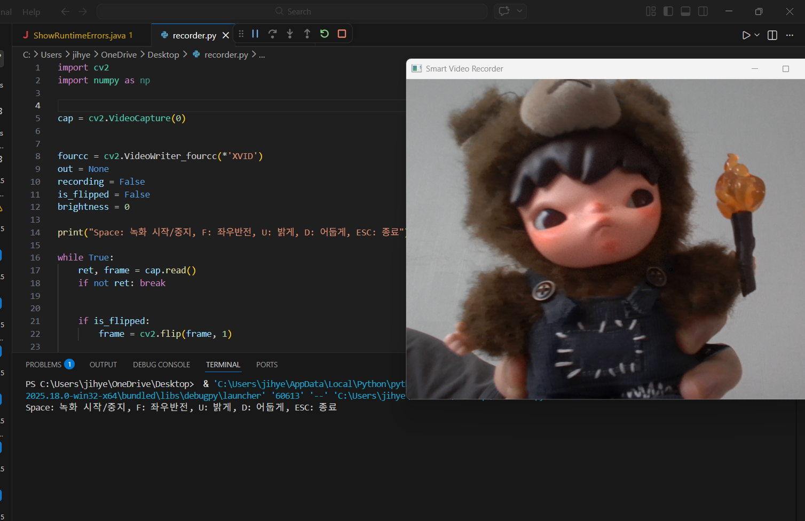

# Smart-video-recorder
My simple video recorder using OpenCV
## 기능 설명
- **녹화 기능**: Space 키로 시작/중지 (화면 상단 빨간 원 표시)
- **기능 1 (Flip)**: 'F' 키를 눌러 좌우 반전
- **기능 2 (Brightness)**: 'U' 키로 밝게, 'D' 키로 어둡게 조절

## 조작법
- Space: Record/Stop
- F: Flip Screen
- U / D: Brightness Up/Down
- ESC: Exit

## 실행 화면

